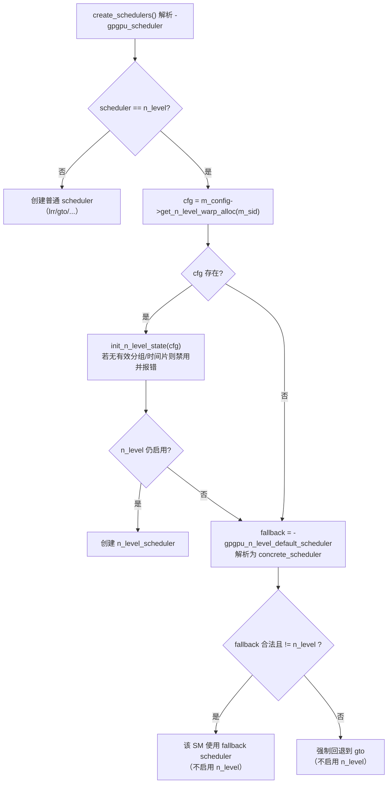
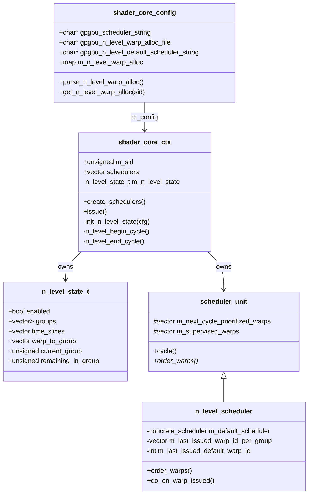
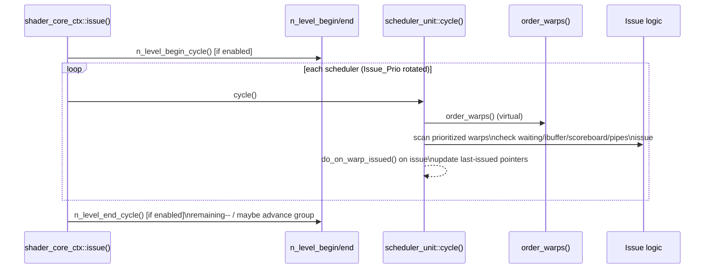
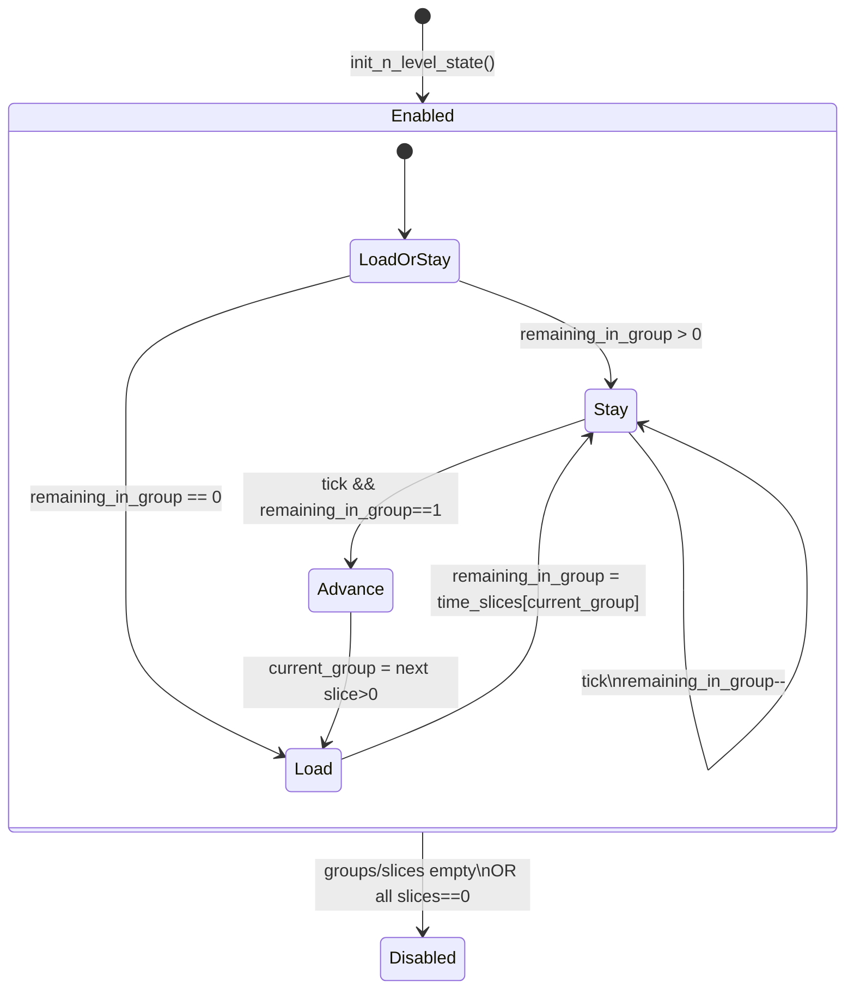
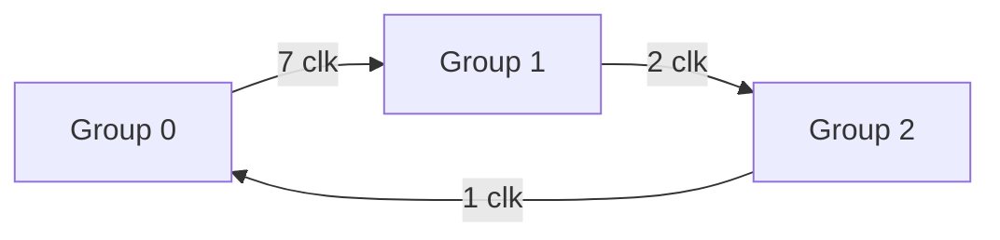
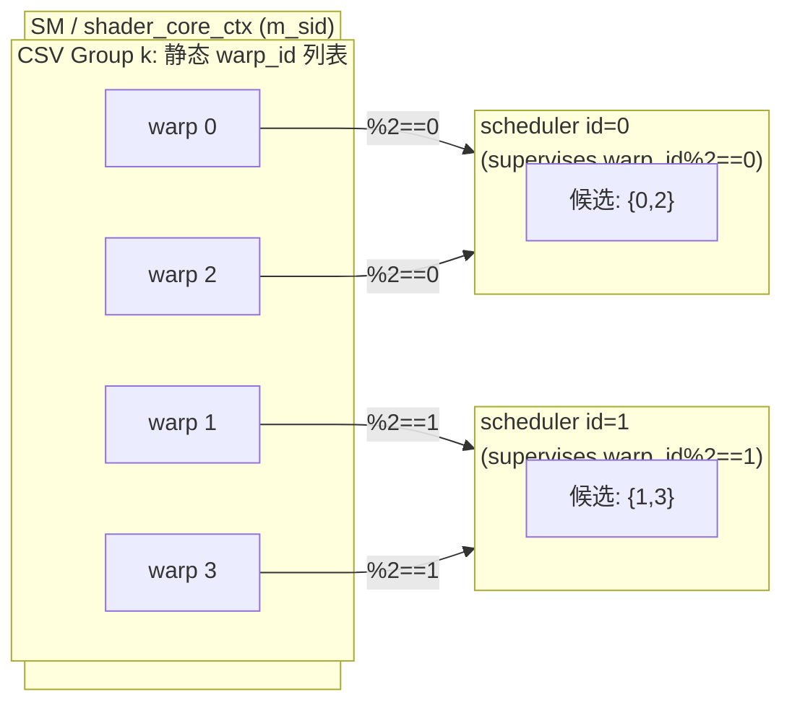

# N-Level（Time-Sliced）Warp Scheduler（`n_level`）改动逻辑完整说明（基于当前代码状态）

> 目的：让你/新同事能够“读完就能复查代码”，理解我改了哪些地方、每处改动的意图、运行期状态机如何推进、以及每条关键分支在代码里怎么走。  
> 说明：本说明严格以当前 workspace 代码为准；若与“期望语义”不一致，会在 **边界情况** 里如实对照并给出最小修正思路（不改代码）。

---

## 1) 配置（Config）

### 1.1 如何启用 `n_level`

在配置中指定：

- `-gpgpu_scheduler n_level`
  - 入口解析在 `accel-sim-framework/gpu-simulator/gpgpu-sim/src/gpgpu-sim/shader.cc`（`shader_core_ctx::create_schedulers()`）
  - 解析方式：**子串匹配**（只要包含 `n_level` 或 `nlevel` 即判定为 n_level），实现见同文件的 `parse_scheduler_config()`。

新增的两个配置项（在 `accel-sim-framework/gpu-simulator/gpgpu-sim/src/gpgpu-sim/gpu-sim.cc` 的 `shader_core_config::reg_options()` 注册）：

- `-gpgpu_n_level_warp_alloc_file <path>`
  - 类型：字符串
  - 默认值：`""`（空串）
  - 行为：在 `shader_core_config::init()` 中调用 CSV 解析（`parse_n_level_warp_alloc()`），读取每个 SM 的分组与时间片配置。
  - 错误行为（当前实现）：
    - 空串/NULL：
      - 若 `-gpgpu_scheduler n_level`：打印 **error**（说明未提供配置文件），并回退到默认调度器。
      - 否则：静默忽略。
    - 文件打不开：
      - 若 `-gpgpu_scheduler n_level`：打印 **error**（说明无法读取配置文件），并回退到默认调度器。
      - 否则：打印 warning。
    - 文件可读但解析后无有效 SM 条目：打印 **error**，并回退到默认调度器。

- `-gpgpu_n_level_default_scheduler <string>`
  - 类型：字符串
  - 默认值：`"gto"`
  - **当前实现的真实用途有两个**：
    1) 当 `-gpgpu_scheduler n_level` 但某个 SM 在 CSV 中没有条目时，该 SM 会回退到这个 default scheduler（见 1.3）。
    2) 当某个 SM 有 n_level 配置但 **存在未被分组的 warp slot**（`warp_to_group == -1`）时，这些“未分组 warps”会在每个 cycle 的候选列表末尾按 default scheduler 的顺序附加（见 `n_level_scheduler::order_warps()`），这会影响边界语义（见第 5 节）。

### 1.2 `-gpgpu_scheduler` 的合法值（按当前实现）

尽管 help 文本只列了部分，实际代码解析支持这些（见 `parse_scheduler_config()`）：

- `lrr`
- `gto`
- `two_level_active`
- `rrr`
- `old`（oldest-first）
- `warp_limiting`
- `n_level` / `nlevel`

**错误行为**：若字符串不匹配任何一种，`shader_core_ctx::create_schedulers()` 会 `assert(scheduler != NUM_CONCRETE_SCHEDULERS)` 直接中止（fatal）。

### 1.3 `n_level` 的回退路径（缺省与回退）

当配置了 `-gpgpu_scheduler n_level` 时，每个 SM 在 `shader_core_ctx::create_schedulers()` 会走以下路径：



关键点：
- “cfg 存在”取决于 `warp_allocate.csv` 是否包含该 `SM id (= m_sid)`。
- 当 cfg 不存在时：本 SM **不会创建** `n_level_scheduler`，而是创建 fallback scheduler（例如 gto），并打印 **error**（当文件中确实有其他 SM 条目时）。
- 当 cfg 存在但解析后“无有效分组/时间片”（如组为空或 time_slices 全 0）时：**禁用 n_level 并回退**到 fallback scheduler，同时打印 **error**。
- 当 cfg 存在且有效时：会创建 `n_level_scheduler`，并在本 SM 内启用 `m_n_level_state`。

---

## 2) 解析（Parsing）

### 2.1 解析入口与时机

解析函数：`shader_core_config::parse_n_level_warp_alloc()`  
- 位置：`accel-sim-framework/gpu-simulator/gpgpu-sim/src/gpgpu-sim/shader.cc`（函数名：`parse_n_level_warp_alloc`）
- 调用时机：`shader_core_config::init()` 末尾调用（见 `accel-sim-framework/gpu-simulator/gpgpu-sim/src/gpgpu-sim/shader.h`，在 `init()` 内调用 `parse_n_level_warp_alloc()`）。

这意味着：
- CSV **在仿真初始化阶段读取一次**，运行期间不会动态更新。
- 解析结果存储在 `shader_core_config` 对象里，所有 SM 共享同一份“配置映射”。

### 2.2 `warp_allocate.csv` 当前实现支持的格式（真实行为）

解析采用“顶层逗号分割 + 括号内逗号不分割”的简易 CSV：
- 顶层分隔符：`,`
- 括号 `(...)` 内可以包含逗号，不会被分割（通过 depth 计数实现）
- 不支持 CSV 引号转义（例如 `"a,b"` 这种不会按标准 CSV 处理）
- 注释：
  - 行首 `#`：整行跳过
  - 行内 `#`：仅在“顶层”（不在括号内）出现时视为注释起点，后续截断

相关辅助函数位于 `accel-sim-framework/gpu-simulator/gpgpu-sim/src/gpgpu-sim/shader.cc` 顶部匿名 namespace：
- `split_top_level_csv`
- `parse_paren_list`
- `parse_uint`

### 2.3 列定义（按当前解析逻辑）

最少需要 3 列：

1) `SM`：无符号整数（对应 `shader_core_ctx::m_sid`）
2) `warp 数量分组`：括号列表，例如 `(7,5,4)`
3) `时间片分配`：括号列表，例如 `(10,5,4)`
4) `第一组 warp 列表`：括号列表，例如 `(15,14,...)`
5) `第二组 warp 列表`
6) ...

示例：
```
0,(7,5,4),(10,5,4),(15,14,13,12,11,10,9),(8,7,6,5,4),(3,2,1,0)
```

### 2.4 “组数量”如何确定（重要：当前是容错而非严格）

解析时会计算：

- `listed_groups = tokens.size() - 3`
- `group_count = min(group_sizes.size(), time_slices.size(), listed_groups)`

若三者不一致：会 warning，并只取最小值（剩余内容忽略）。

### 2.5 解析结果在内存中的表达

每个 SM 对应一个 `n_level_warp_group_config`（定义在 `accel-sim-framework/gpu-simulator/gpgpu-sim/src/gpgpu-sim/shader.h`）：

- `groups: vector<vector<unsigned>>`：每组的静态 warp slot id 列表
- `time_slices: vector<unsigned>`：每组的时间片长度（clk 数）

解析结果存储在：
- `shader_core_config::m_n_level_warp_alloc`（`map<unsigned, n_level_warp_group_config>`）

获取接口：
- `shader_core_config::get_n_level_warp_alloc(unsigned sid)`

### 2.6 解析阶段的校验行为（真实行为）

解析阶段分为“全局级报错 + 行级 warning”两类：

- **全局级报错**（仅当 `-gpgpu_scheduler n_level` 时触发）：
  - 未指定 `-gpgpu_n_level_warp_alloc_file`：error，所有 SM 回退默认调度器。
  - 文件打不开：error，所有 SM 回退默认调度器。
  - 文件可读但最终没有任何有效 SM 条目：error，所有 SM 回退默认调度器。

- **行级 warning**（容错继续）：

- 行格式不对 / 列数不足：warning，跳过该行
- `SM` 不是整数：warning，跳过该行
- 组大小列表 / 时间片列表解析失败：warning，跳过该行
- group_count mismatch：warning，截断到最小 group_count
- 某组 warp 列表解析失败：warning，该组保持为空（但仍存在这个组）
- 某组的 “expected size” 与列表长度不一致：warning，但仍接受该列表
- warp_id 越界：warning
- 同一行中跨组重复 warp_id：warning，但仍接受
- 同一个 SM 在文件中出现多次：warning，后者覆盖前者

---

## 3) 运行期状态（Runtime State）

### 3.1 三层状态：全局配置 / 每-SM 状态 / 每-scheduler 指针

当前实现把状态拆成三层：

1) **全局（config 级）**：CSV 解析结果  
   - `shader_core_config::m_n_level_warp_alloc`

2) **每个 SM（shader_core_ctx 级）**：当前处于哪一组、剩余多少 clk  
   - `shader_core_ctx::m_n_level_state`

3) **每个 warp scheduler（scheduler_unit 派生类实例级）**：组内 RR 的“上次发射位置”  
   - `n_level_scheduler::m_last_issued_warp_id_per_group`（每组一个 last-issued warp_id）
   - `n_level_scheduler::m_last_issued_default_warp_id`（用于“未分组 warps”的 default tail）

### 3.2 `shader_core_ctx::m_n_level_state` 字段解释（关键数据结构）

结构体字段（在 `accel-sim-framework/gpu-simulator/gpgpu-sim/src/gpgpu-sim/shader.h` 的 `shader_core_ctx` 私有区定义）：

- `enabled`：本 SM 是否启用 n_level
- `groups`：本 SM 的分组（从 cfg 拷贝）
- `time_slices`：本 SM 的时间片（从 cfg 拷贝）
- `warp_to_group`：长度为 `max_warps_per_shader` 的映射表  
  - 值为 `g>=0` 表示 warp slot 属于第 g 组  
  - 值为 `-1` 表示未被分组（当前实现会走 default tail 逻辑）
- `current_group`：本 clk 周期“当前活动组”的组号
- `remaining_in_group`：当前组剩余时间片（clk）

访问器在 `shader_core_ctx` 公有区：
- `n_level_enabled()`
- `n_level_current_group()`
- `n_level_group_for_warp(warp_id)`
- `n_level_groups()`

### 3.3 初始化位置与数据流

初始化发生在 `shader_core_ctx::create_schedulers()`：
- 如果本 SM 在 CSV 中有条目，则 `init_n_level_state(cfg)` 会：
  - 拷贝 `groups/time_slices`
  - 建 `warp_to_group`（遇到同一个 warp 出现在多个组会 warning，**第一个生效**）
  - 设 `current_group=0, remaining=0`，并调用一次 `n_level_begin_cycle()` 以装载首个时间片



---

## 4) 调度逻辑（Scheduling Logic）

### 4.1 issue 阶段的整体调用关系（插入点在哪）

核心事实：**没有改 `scheduler_unit::cycle()` 的发射判定流程**，只是在两个地方“插入/扩展”：

1) 在 `shader_core_ctx::issue()` 前后插入时间片推进（begin/end）  
2) 新增 `n_level_scheduler::order_warps()`：用“当前活动组 + 组内 RR”来构造本 cycle 的 `m_next_cycle_prioritized_warps`

`shader_core_ctx::issue()` 的关键时序（真实代码抽象）：



### 4.2 时间片推进的状态机（每 clk 消耗 1）

时间片推进由两个函数完成：

- `shader_core_ctx::n_level_begin_cycle()`
  - 当 `remaining_in_group == 0` 时，为当前 `current_group` 装载 `time_slices[current_group]`
  - 会跳过 `time_slices == 0` 的组
  - 若所有组 time slice 都为 0，会把 `enabled=false` 关闭 n_level

- `shader_core_ctx::n_level_end_cycle()`
  - 每次调用都 `remaining_in_group--`
  - 当减到 0 时，将 `current_group` 移动到下一个 `time_slices>0` 的组，并把 `remaining_in_group` 重置为该组的 slice

> 结论：当前实现是 **每个 clk（每次 issue() 调用）固定消耗 1**，不依赖是否成功 issue。

抽象状态机（概念图）：



时间片循环示意（例如 3 组，slice 为 7/2/1）：



### 4.3 组内 RR 的实现方式（每个 scheduler 自己维护）

组内 RR 的“起点”由 `n_level_scheduler` 自己维护：

- `m_last_issued_warp_id_per_group[group_id]`：记录该 scheduler 在该组内上次成功发射的 warp_id
- 本 cycle 的 RR 列表从 “上次发射 warp 的下一个” 开始拼出来

更新发生在：
- `n_level_scheduler::do_on_warp_issued()`（当某 warp 成功 issue 时更新 last-issued）
- 若 n_level 在运行期被禁用，会改为更新 **default scheduler** 的 last-issued（保证默认轮转顺序生效）。

### 4.4 多 scheduler per core：warp slot 分配与 n_level 生效方式

GPGPU-Sim 的 warp scheduler 不是“一个 SM 一个队列”，而是：
- SM 内有 `gpgpu_num_sched_per_core` 个 scheduler 实例
- warp slot `warp_id` 会被静态分配给某个 scheduler：`warp_id % gpgpu_num_sched_per_core`

`n_level` 的组是按 **静态 warp slot id** 写在 CSV 里的。为了让每个 scheduler 只看自己“监督”的 slot，`n_level_scheduler::order_warps()` 内做了过滤：

- 只把满足 `(warp_id % num_sched) == scheduler_id` 的 warp 放入该 scheduler 的候选列表。

示意图：



关键含义：
- **组选择（current_group）是 SM 级全局的**：同一个 clk 内所有 scheduler 都会聚焦同一组。
- **组内 RR 是 scheduler 级局部的**：每个 scheduler 在自己的子集内 RR。

### 4.5 “未分组 warps（warp_to_group==-1）”当前怎么处理（真实行为）

当前实现：如果某个 SM 有 n_level 配置，但 `warp_to_group` 里存在 `-1`（未分组 slot），这些 warps 会被收集到 `default_warps`，并附加在 `m_next_cycle_prioritized_warps` 的末尾：

- `n_level_scheduler::order_warps()`：收集 `warp_group < 0` 的 supervised warps，然后 `append_default_warps(default_warps, prioritized_list)`

`append_default_warps` 的排序策略取决于 `-gpgpu_n_level_default_scheduler`：
- `lrr/rrr`：按 last-issued 做 RR
- `oldest-first`：按 dynamic_warp_id 排序
- 其他（包含 `gto`）：按 oldest 排序 + greedy(last-issued) 放首位（近似 gto 的“greedy then oldest”风格）

这点会直接影响边界语义 #2/#3（见第 5 节）。

---

## 5) 边界情况（Edge Cases）

### 5.1 常见边界/异常输入的当前行为

- **CSV 文件缺失/未指定/打不开/无有效条目**：若 `-gpgpu_scheduler n_level`，打印 **error**；所有 SM 回退到 `-gpgpu_n_level_default_scheduler`。
- **CSV 行格式不对/括号不配对/字段缺失**：warning；跳过该行；对应 SM 将视为“缺失 SM 行”，并打印 **error**（当文件中确实存在其他 SM 条目时）。
- **某个 SM 行里 group_count 不一致**：warning；按最小 group_count 截断。
- **warp_id 越界**：warning；运行期会被跳过（不会参与调度）。
- **同一 warp_id 被写到多个组**：解析时 warning；初始化 `warp_to_group` 时再次 warning；最终 **第一个出现的组生效**，后续组对该 warp 无效。
- **组列表为空 / time_slices 为空 / 无有效分组**：该 SM 直接禁用 n_level，打印 **error**，并回退到 default scheduler。
- **time_slices 某组为 0**：begin/end 会跳过该组；若所有组都为 0，该 SM 禁用 n_level，打印 **error**，并回退到 default scheduler。
  - 若 n_level 在运行期被禁用（例如全 0 的场景），`n_level_scheduler::order_warps()` 会按 **default scheduler** 排序（不是 LRR）。

### 5.2 你关心的边界语义对照（逐条）

下面对照“当前实现是否满足”。若不满足，说明偏差与最小修正思路（不改代码，仅给方案）。

| 边界语义 | 是否满足（当前实现） | 依据代码位置（文件+函数名） | 当前实际行为（如不满足则说明偏差） | 最小修正思路（只给方案） |
|---|---|---|---|---|
| 1) 时间片按 clk 消耗（每 clk 消耗 1） | 满足 | `shader.cc: shader_core_ctx::issue` + `shader.cc: shader_core_ctx::n_level_end_cycle` | 与是否成功 issue 无关；每个 `issue()` 调用都会消耗 1 | 无 |
| 2) 某组时间片内无 ready warp：空转到时间片结束（不借用下一组） | **部分满足** | 组推进：`shader.cc: shader_core_ctx::n_level_end_cycle`；候选构造：`shader.cc: n_level_scheduler::order_warps` | 组不会因“无 ready”提前切换（满足“不借用下一组”）；但如果存在 **未分组 warps**，它们会被附加到候选末尾，`scheduler_unit::cycle()` 可能会在组内都不 ready 时转而 issue 这些 default warps，从而不再“空转”。 | 若要严格“只在本组候选”：在 `n_level_scheduler::order_warps()` 中去掉 `default_warps` 追加；或增加硬门控（当 active group 无 ready 时也不得扫描其他列表）。 |
| 3) default scheduler 仅用于缺失 SM 行；配置 SM 下 warp slot 必须恰好一次分配到某组（不允许遗漏/重复） | **不满足** | default tail：`shader.cc: n_level_scheduler::order_warps`；重复/遗漏仅 warning：`shader.cc: shader_core_config::parse_n_level_warp_alloc` 与 `shader.cc: shader_core_ctx::init_n_level_state` | 当前实现允许：重复 warp（warning，且“先到先得”）；允许遗漏 warp（映射为 -1，并在调度末尾按 default scheduler 继续参与发射）。default scheduler 也被用于“已配置 SM 的未分组尾巴”，不只用于“缺失 SM 行”。 | 解析阶段做严格校验并 fail-fast：要求 group 覆盖 `0..max_warps_per_shader-1` 且无重复；运行期对不满足直接 `abort()` 或至少禁用 n_level 并回退；同时移除“未分组尾巴”逻辑，仅保留“缺失 SM 行”的整体回退。 |
| 4) CSV 给的是静态 warp slot 编号；每个 scheduler 只看自己监督的 slot 属于哪一组即可 | 满足 | warp 分配：`shader.cc: shader_core_ctx::create_schedulers`；组内过滤：`shader.cc: n_level_scheduler::order_warps` | 每个 scheduler 只调度自己的 slot 子集；组是 SM 级全局，scheduler 级局部过滤 | 无 |

---

## 6) 变更清单（Change Log：函数级，贴关键 patch 片段）

### 6.1 涉及文件总览（新增/修改）

- `accel-sim-framework/gpu-simulator/gpgpu-sim/src/gpgpu-sim/gpu-sim.cc`  
  在 `shader_core_config::reg_options()` 注册了 2 个新的 config 选项，并更新 `-gpgpu_scheduler` 的 help 文本以暴露 `n_level`。不改动具体调度逻辑，仅提供配置入口。

- `accel-sim-framework/gpu-simulator/gpgpu-sim/src/gpgpu-sim/shader.h`  
  添加了新的 `CONCRETE_SCHEDULER_N_LEVEL` 枚举值、`n_level_warp_group_config` 配置结构体、`n_level_scheduler` 类声明；在 `shader_core_config` 里添加了 CSV 路径/默认调度器字符串与配置 map；在 `shader_core_ctx` 里添加了 `m_n_level_state` 与相关私有方法/公有访问器。

- `accel-sim-framework/gpu-simulator/gpgpu-sim/src/gpgpu-sim/shader.cc`  
  实现了简易 CSV 解析工具函数、实现 `shader_core_config::parse_n_level_warp_alloc()`，实现 `shader_core_ctx` 的 n_level 状态机（init/begin/end）并在 `issue()` 中推进时间片；实现 `n_level_scheduler` 的 `order_warps/do_on_warp_issued` 并在 `create_schedulers()` 增加 `n_level` 分支与回退路径。

- `accel-sim-framework/gpu-simulator/gpgpu-sim/doc/n_level_warp_scheduler.md`  
  新增了一个初版说明（概览性质）。

### 6.2 关键函数列表（按数据流顺序）

1) 配置注册与读取  
- `shader_core_config::reg_options()`：`gpu-sim.cc`（注册新 option）

2) CSV 解析与存储  
- `shader_core_config::parse_n_level_warp_alloc()`：`shader.cc`  
- `shader_core_config::get_n_level_warp_alloc()`：`shader.cc`

3) SM 初始化与回退选择  
- `shader_core_ctx::create_schedulers()`：`shader.cc`

4) 运行期时间片推进  
- `shader_core_ctx::issue()`：`shader.cc`（插入 begin/end）  
- `shader_core_ctx::n_level_begin_cycle()`：`shader.cc`  
- `shader_core_ctx::n_level_end_cycle()`：`shader.cc`

5) 候选 warp 排序（组内 RR）  
- `n_level_scheduler::order_warps()`：`shader.cc`  
- `n_level_scheduler::do_on_warp_issued()`：`shader.cc`

### 6.3 关键 patch 片段（节选）

#### (1) 新增 config 选项与 help 文本：`gpu-sim.cc`

```diff
option_parser_register(
    opp, "-gpgpu_n_level_warp_alloc_file", OPT_CSTR,
    &gpgpu_n_level_warp_alloc_file,
    "CSV path for n_level warp grouping and time slices", "");
option_parser_register(
    opp, "-gpgpu_n_level_default_scheduler", OPT_CSTR,
    &gpgpu_n_level_default_scheduler_string,
    "Default scheduler when n_level config is missing or incomplete", "gto");
```

意义：把 n_level 的配置入口暴露给 config，使得后续 `create_schedulers()` 能拿到 CSV 路径与 default scheduler。

#### (2) 新增 `n_level` 类型与状态声明：`shader.h`

```diff
CONCRETE_SCHEDULER_N_LEVEL,

struct n_level_warp_group_config {
  std::vector<std::vector<unsigned>> groups;
  std::vector<unsigned> time_slices;
};

class n_level_scheduler : public scheduler_unit { ... };

struct n_level_state_t { ... };
```

意义：在头文件层面把“n_level 的配置载体、运行期状态载体、调度器类”挂到现有架构上，尽量不侵入原本的发射流程。

#### (3) 时间片推进插入到 `issue()`：`shader.cc`

```diff
if (m_n_level_state.enabled) n_level_begin_cycle();
...
if (m_n_level_state.enabled) n_level_end_cycle();
```

意义：把“时间片消耗”绑定到每个 SM 的 issue 周期（clk），实现“每 clk 消耗 1”的语义。

#### (4) 候选列表核心：`n_level_scheduler::order_warps()`：`shader.cc`

```diff
unsigned group_id = m_shader->n_level_current_group();
// filter by scheduler id: warp_id % num_sched == m_id
// RR within group starting after last-issued
...
append_default_warps(default_warps, m_next_cycle_prioritized_warps);
```

意义：n_level 的“只看组内候选”是通过构造优先列表实现的；但末尾追加 default_warps 会影响“空转”语义（见第 5 节对照）。

#### (5) CSV 解析核心：`parse_n_level_warp_alloc()`：`shader.cc`

```diff
std::ifstream input(gpgpu_n_level_warp_alloc_file);
while (std::getline(input, line)) {
  split_top_level_csv(trimmed, &tokens);
  parse SM id / group_sizes / time_slices;
  group_count = min(...);
  parse each group warp list; warn on mismatch/duplicate/out-of-range;
  m_n_level_warp_alloc[sm_id] = cfg;
}
```

意义：提供按 SM 配置分组与时间片的数据源；行级仍是 warning+容错（对应边界语义 #3 不满足），但当 `n_level` 启用且文件缺失/无有效条目时会报错并回退。

---

## 7) 已知限制/后续工作（Limitations & Future Work）

### 7.1 已知限制（基于当前实现的真实风险点）

- **严格性不足**：CSV 的组覆盖/重复/遗漏目前都是 warning，不会阻止运行；并且遗漏会导致“未分组 warps 仍可能在任意组时间片内 issue”，从而破坏严格 time-slicing 的隔离语义。
- **default scheduler 的语义扩展**：当前 default scheduler 不仅用于“缺失 SM 行”，还用于“已配置 SM 的未分组尾巴”。如果你要求“配置 SM 必须严格分组”，这会偏离预期。
- **全 0 time slice 的行为**：若所有 time slice 都是 0，该 SM 会禁用 n_level、打印 error，并回退到 default scheduler；若运行期仍出现 disable，`order_warps()` 会按 default scheduler 排序。
- **CSV 解析不是标准 CSV**：不支持引号、转义等；仅支持括号列表形式。
- **缺少可观测性（trace）**：当前没有输出“当前 group/remaining”的 trace；调试时不容易验证时间片切换是否符合预期。

### 7.2 后续工作建议（不实现，仅说明切入点）

- **严格校验（强烈建议）**：  
  切入点：`shader_core_config::parse_n_level_warp_alloc()`  
  建议做法：增加严格模式（或外部 Python 校验脚本）强制：
  - 一个配置 SM 必须覆盖 `0..max_warps_per_shader-1` 每个 warp 恰好一次
  - group_sizes 必须与列表长度一致
  - group_count 必须一致  
  不满足则 fail-fast（`abort()`）或拒绝启用 n_level。

- **严格“空转”语义**：  
  切入点：`n_level_scheduler::order_warps()`  
  建议做法：不要 append `default_warps`；或者改 `scheduler_unit::cycle()` 使其只扫描 active-group 列表（更侵入）。

- **增强可观测性**：  
  切入点：
  - `shader_core_ctx::issue()` 内输出 group/remaining（可 gated by config）
  - 或集成到 `issue_tracer` 输出组号字段

- **支持“借时/跳过”策略**：  
  切入点：`shader_core_ctx::n_level_end_cycle()`  
  当组内无任何可 issue warp 时，允许提前切换/借用下一组时间片（这会改变边界语义 #2，因此应做成可选策略）。
